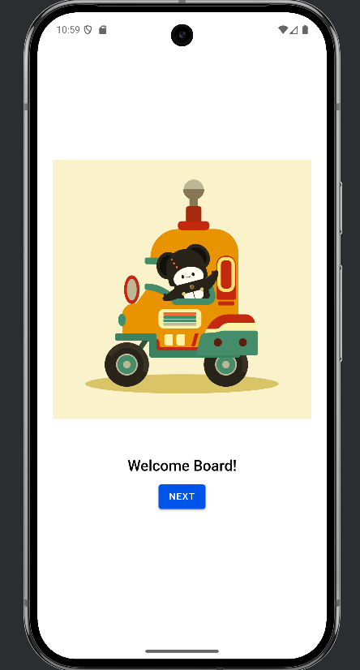
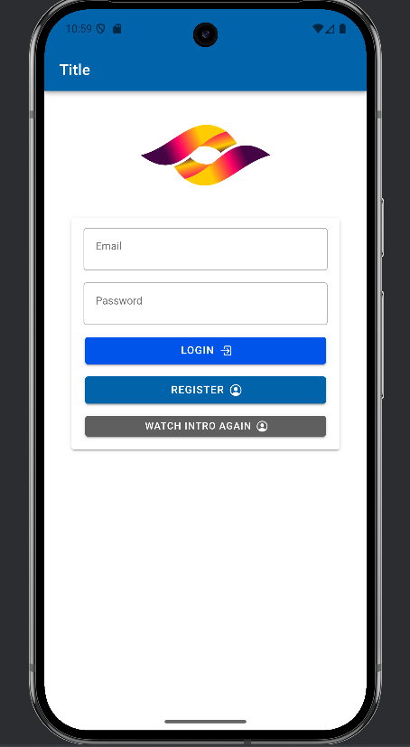
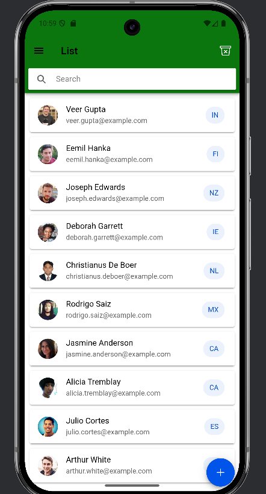

📱 Ionic React Learning Project
This is a beginner-friendly Ionic + React project created to explore the basics of Ionic app development.
The app is frontend-only, powered by a free public API, and integrates Capacitor features such as device preferences and camera access.
It was also tested with Android Studio for mobile deployment.

🚀 Features
Welcome Slides – Smooth onboarding using Ionic’s slider component.

Authentication Screens – Simple Login and Register pages.

Home Page – Displays content fetched from a free API.

Animations – Explored Ionic animation utilities for smooth transitions.

Camera Integration – Capture and use images with Capacitor’s Camera API.

Preferences – Store and retrieve small amounts of data using Capacitor Preferences.

Mobile Testing – Integrated with Android Studio for testing on mobile devices.

🛠️ Tech Stack
Ionic + React

Capacitor (Camera, Preferences)

Free Public API for data

Android Studio (for device testing)

🌐 Live Demo
[View the App on Netlify](https://stirring-cucurucho-86d823.netlify.app/)

📸 Screenshots







📦 Installation & Setup
To run the project locally:
# Clone the repository
`git clone https://github.com/your-username/your-repo-name.git`

# Navigate into the project folder
`cd your-repo-name`

# Install dependencies
`npm install`

# Start the app
`ionic serve`

To run on Android Studio:
# Add Android platform
<pre>``` bash ionic capacitor add android```</pre>

# Build the app
`ionic build`

# Sync with Android Studio
<pre>```bash ionic capacitor copy android ionic capacitor open android```</pre>

📚 Learning Outcomes
While building this project, I learned:

- Basics of Ionic + React structure

- Using Ionic UI components like sliders, forms, and lists

- Implementing Capacitor plugins (Camera, Preferences)

- Consuming a free API in an Ionic app

- Running and testing an Ionic app in Android Studio
